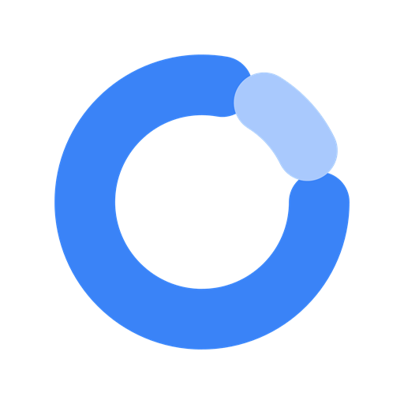
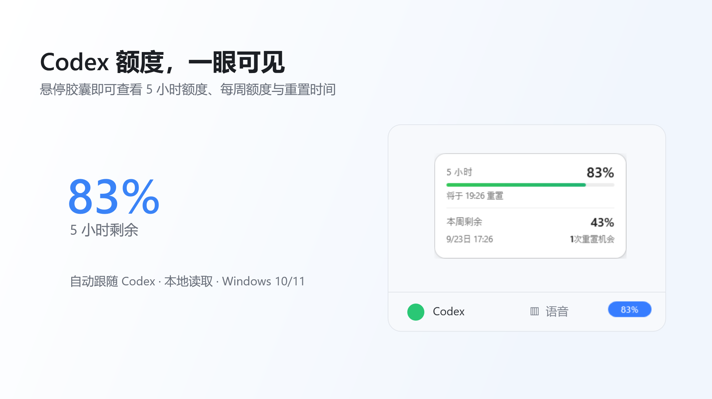
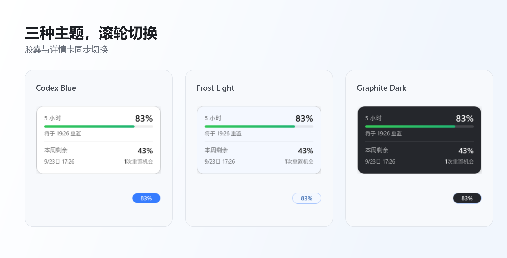

<p align="center">
  
</p>

<h1 align="center">Codex Usage Badge for Windows</h1>

<p align="center">在 Codex 窗口中直接查看 5 小时和每周剩余额度。</p>

<p align="center">
  <a href="https://github.com/returnk/codex-usage-badge/releases/latest"></a>
  <a href="https://github.com/returnk/codex-usage-badge/actions/workflows/ci.yml"></a>
  
  <a href="LICENSE"></a>
</p>

Codex 桌面客户端的额度信息不够直观，查看剩余额度和重置时间容易打断当前操作。**Codex Badge** 会跟随 Codex 窗口，在原额度位置直接展示 5 小时剩余百分比；鼠标悬停即可查看重置时间、本周剩余额度和重置机会。

> 目前仅提供 Windows 10/11 x64 版本，暂不支持 macOS 与 Linux。本项目是非官方开源工具，与 OpenAI 无隶属关系，也未获得 OpenAI 背书。

<p align="center">
  
  <br>
  <sub>界面预览 · 示例数据</sub>
</p>

## 下载

### 推荐：免运行库版本

[**下载 CodexBadge-win-x64-self-contained.exe**](https://github.com/returnk/codex-usage-badge/releases/latest/download/CodexBadge-win-x64-self-contained.exe) · 约 165 MiB · 无需预装 .NET

### 小体积版本

[**下载 CodexBadge-win-x64-framework-dependent.exe**](https://github.com/returnk/codex-usage-badge/releases/latest/download/CodexBadge-win-x64-framework-dependent.exe) · 约 0.30 MiB · 需要 [.NET 10 Desktop Runtime x64](https://dotnet.microsoft.com/download/dotnet/10.0)

[查看全部版本与 SHA-256 校验文件](https://github.com/returnk/codex-usage-badge/releases/latest)

## 30 秒开始使用

1. 下载推荐的 Self-contained 版本并运行。
2. 打开已登录的 Codex Windows 桌面客户端。
3. 胶囊会自动出现在 Codex 底部；软件没有主窗口，通过系统托盘管理。

这是未签名的便携程序，Windows 首次运行时可能显示未知发布者提示。你可以在 Release 页面下载 `SHA256SUMS.txt` 核对文件完整性。

## 功能

- 自动跟随 Codex 窗口；Codex 最小化或关闭时自动隐藏
- 显示 5 小时额度，悬停查看完整详情
- 5 小时进度条按额度显示绿色、黄色或橙红色
- 鼠标滚轮切换蓝色、浅色和深色主题
- 拖动胶囊微调位置，双击恢复默认位置且保留当前主题
- 当前用户开机启动，无需管理员权限
- 单文件、便携运行

<p align="center">
  
  <br>
  <sub>Codex Blue · Frost Light · Graphite Dark</sub>
</p>

设置保存在 `%LOCALAPPDATA%\CodexBadge\settings.json`。托盘菜单可控制开机启动、重新定位或退出。

## 常见问题

**胶囊没有显示**

确认 Codex 主窗口已经打开且没有最小化。仍未显示时，可从托盘菜单选择“重新定位”。

**胶囊显示 `--%` 或暂时无法读取额度**

确认 Codex 已登录，且本机 Codex CLI 可以正常运行。如果无法自动找到 CLI，可将环境变量 `CODEX_BADGE_CLI` 设置为 `codex.exe` 的完整路径。

**小体积版本无法启动**

安装 [.NET 10 Desktop Runtime x64](https://dotnet.microsoft.com/download/dotnet/10.0)，或改用 Self-contained 版本。

## 隐私

Codex Badge 通过本机 `codex app-server` 读取额度。它不读取 `auth.json`，不调用内部 `wham` 接口，也不会自行上传你的登录凭据。所有设置只保存在本机 `%LOCALAPPDATA%\CodexBadge`。

## 从源码构建

需要 .NET 10 SDK：

```powershell
dotnet run --project .\tests\CodexBadge.Core.Tests\CodexBadge.Core.Tests.csproj
.\publish.ps1
```

构建结果和 `SHA256SUMS.txt` 保存在 `artifacts/`，该目录不会提交到源码仓库。

## License

[MIT](LICENSE)
