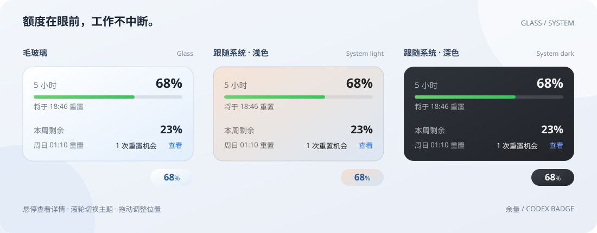

<h1 align="center">Codex Badge · 余量</h1>

<strong>Your Codex quota, at a glance.</strong>

A Windows sidebar badge for Codex usage limits, reset times, and reset credits.

<a href="../README.md">简体中文</a> · <a href="#download">Download</a> · <a href="#get-started">Get started</a> · <a href="https://github.com/returnk/codex-usage-badge/issues">Feedback</a>

Keep your remaining quota in view without leaving your work. The badge sits alongside Codex; hover to see your 5-hour and weekly remaining limits, reset times, and available reset credits.

  
   UI illustration with sample data · Two theme choices: Glass / System

## Download

**v0.3.0-beta.1** · Windows 10 / 11 x64 · Prerelease

[**Installer (recommended)**](https://github.com/returnk/codex-usage-badge/releases/download/v0.3.0-beta.1/CodexBadge-v0.3.0-beta.1-windows-x64-setup.exe) · [Portable ZIP](https://github.com/returnk/codex-usage-badge/releases/download/v0.3.0-beta.1/CodexBadge-v0.3.0-beta.1-windows-x64-portable.zip) · [Release notes](https://github.com/returnk/codex-usage-badge/releases/tag/v0.3.0-beta.1) · [SHA-256](https://github.com/returnk/codex-usage-badge/releases/download/v0.3.0-beta.1/SHA256SUMS.txt)

Requires WebView2 Runtime, the signed-in Codex Windows desktop app, and a working Codex CLI. The installer can download WebView2 if needed. No .NET runtime required. The app is unsigned; Windows may show a security warning. Download only from this repository.

## Get started

1. Install, or extract the ZIP and run `codex-badge-tauri.exe`.
2. Open Codex. The badge appears automatically.
3. Right-click the badge or tray icon to enable launch at login or always-on-top mode.

Leave Codex Badge running in the background to follow Codex opening and closing. Choosing **退出** (Exit) stops the watcher until you launch the badge again.

## Everyday controls

| Action | Result |
| --- | --- |
| Hover | Show remaining quota and reset times |
| Click **查看** | Show reset-credit expiry details, when available |
| Mouse wheel | Switch **Glass / System**; System follows Windows light/dark appearance |
| Drag | Move the badge; each display mode remembers its own position |
| Right-click | Launch at login, always-on-top, reposition, or exit |
| Double-click | Reset position in normal mode; retain position in always-on-top mode |

Normal mode hides when Codex is minimized. Always-on-top mode remains visible while Codex is minimized. Both modes hide when Codex exits. The current app interface is in Chinese.

## Help

- **Badge missing?** Check that Codex Badge is running and the Codex window is open. Try **重新定位** (Reposition) from the tray menu.
- **`--%`?** Check your Codex sign-in and CLI. If the CLI cannot be found, set `CODEX_BADGE_CLI` to the full path of `codex.exe`.
- **Updating or moving the portable app?** Disable launch at login, exit the running copy, then launch the new copy and re-enable it if needed.

This prerelease may briefly show visual artifacts during rapid hovering. Installer upgrades, display scaling, and multi-monitor behavior are still being validated. More details are in the [release notes (Chinese)](../CodexBadge.Tauri/docs/releases/v0.3.0-beta.1.md).

## Privacy and feedback

Reads quota through the local `codex app-server`. It does not read `auth.json`, send model requests, or upload login credentials. Settings and diagnostics stay in `%LOCALAPPDATA%\CodexBadge`.

[Report an issue](https://github.com/returnk/codex-usage-badge/issues/new/choose) with steps to reproduce, display scaling, and theme. Remove personal information and credentials from screenshots and logs.

[Build from source](../CodexBadge.Tauri/README.md) · [MIT License](../LICENSE)

Independent open-source tool. Not an official OpenAI product.
